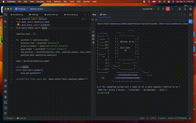

# Welcome to my Quiz_game
##  Retrieve the data form url
```Python
https://opentdb.com/api_config.php 
```
## Creation of a class named Question 
```Python
class Question:
    def __init__(self, q_text, q_answer, i_answer):
        self.text = q_text
        self.answer = q_answer
        self.inccorect_answer = i_answer
```
```Python

ascii = """
                             ______                     
 _________        .---"""      """---.              
:______.-':      :  .--------------.  :             
| ______  |      | :                : |             
|:______B:|      | |  Welcome to my | |             
|:______B:|      | |                | |             
|:______B:|      | |  Quiz Game     | |             
|         |      | |      🎊        | |             
|:_____:  |      | |                | |             
|    ==   |      | :                : |             
|       O |      :  '--------------'  :             
|       o |      :'---...______...---'              
|       o |-._.-i___/'             \._              
|'-.____o_|   '-.   '-...______...-'  `-._          
:_________:      `.____________________   `-.___.-. 
                 .'.eeeeeeeeeeeeeeeeee.'.      :___:
    fsc        .'.eeeeeeeeeeeeeeeeeeeeee.'.         
              :____________________________:
"""

https://opentdb.com/api_config.php # Retrieve the data form url

#  import a class from different files
from question import Question
from data import questions_data
from quiz_brain import QuizBrain
from ascii_table import ascii

#Create a variable question_bank list object
question_bank = []

# creat a class object with tree attributes
class Question: 
    def __init__(self, q_text, q_answer, i_answer): # init the object class
        self.text = q_text
        self.answer = q_answer
        self.inccorect_answer = i_answer

# creat a class object QuizBrain
class QuizBrain:
    def __init__(self, q_list):
        self.question_number = 0
        self.question_list = q_list
        self.score = 0

    def still_answer(self):
        return self.question_number < len(self.question_list)
    def get_question(self):
        current_question = self.question_list[self.question_number] # Get question in question_list
        self.question_number += 1 #increment question_nuber by 1
        user_answer = input(f"Q.{self.question_number}: {current_question.text}? \n Make Your choice {current_question.inccorect_answer} \n")
        self.check_answer(user_answer, current_question.answer)

    def check_answer(self, user_answer, correct_answer):
        if user_answer.lower() == correct_answer.lower(): # Check the answer is is correct or not
            self.score += 1
            print("You've got right")
        else:
            print("Your got a wrong answer")
            print(f"Thi answer is: {correct_answer}")
        print(f"Your score is: {self.score}/{self.question_number}")
        print("\n")


for question in questions_data:
    question_text = question["question"]
    question_answer = question["correct_answer"]
    inco_answer = question["incorrect_answers"]
    new_question = Question(question_text, question_answer, inco_answer)
    question_bank.append(new_question)

print(ascii)
while quiz.still_answer():
    quiz.get_question()

print(f"Your final score was: {quiz.score}/{quiz.question_number}")


```

